# BASY  
## Plataforma colaborativa para la construcción, implementación y seguimiento de PACI

**Versión inicial de arquitectura y flujo de trabajo**

---

# 1. Propósito de BASY

BASY es una plataforma digital diseñada para apoyar a educadoras diferenciales, docentes, equipos PIE y otros profesionales en la elaboración, implementación, monitoreo y actualización del **Plan de Adecuación Curricular Individual (PACI)**.

La plataforma no reemplaza el juicio profesional ni toma decisiones autónomas sobre el estudiante. Su función es:

- organizar antecedentes dispersos;
- relacionar evidencias con necesidades educativas;
- vincular el desempeño del estudiante con el Currículum Nacional;
- orientar la selección de apoyos y adecuaciones;
- facilitar el trabajo interdisciplinario;
- reducir tareas administrativas repetitivas;
- mantener trazabilidad de las decisiones;
- generar borradores editables y documentos de seguimiento.

La lógica principal es:

> **Evidencia → necesidad o fortaleza → barrera → objetivo curricular → respuesta educativa → responsable → indicador → seguimiento**

---

# 2. Principios de funcionamiento

## 2.1. Apoyo a la decisión, no reemplazo profesional

BASY propone, organiza y contrasta información. Toda decisión debe ser revisada y validada por profesionales responsables.

## 2.2. Trabajo basado en evidencias

Cada afirmación o recomendación debe indicar:

- documento de origen;
- fecha;
- profesional responsable;
- página o sección;
- nivel de vigencia;
- grado de confianza.

## 2.3. Mirada integral del estudiante

El sistema debe considerar:

- fortalezas;
- intereses;
- participación;
- trayectoria escolar;
- desempeño académico;
- contexto familiar;
- dimensiones socioemocionales;
- barreras del entorno;
- apoyos disponibles;
- opinión del estudiante.

## 2.4. Currículum como referencia común

Las decisiones deben vincularse con:

- nivel educativo;
- asignatura;
- Objetivos de Aprendizaje;
- habilidades;
- conocimientos previos;
- progresión curricular;
- criterios de evaluación.

## 2.5. Diversificación antes que reducción

El orden de análisis debe ser:

1. enseñanza diversificada;
2. apoyos universales;
3. adecuaciones de acceso;
4. apoyos especializados;
5. adecuaciones de Objetivos de Aprendizaje, cuando estén justificadas.

## 2.6. Privacidad desde el diseño

BASY debe incorporar:

- acceso por roles;
- datos cifrados;
- historial de acciones;
- anonimización;
- consentimiento;
- separación entre identidad y expediente;
- prohibición de utilizar datos para entrenar modelos;
- control de descargas;
- respaldo y eliminación segura.

---

# 3. Usuarios de la plataforma

## Usuarios principales

- educadora diferencial;
- coordinador o coordinadora PIE;
- docente de asignatura;
- profesor o profesora jefe;
- equipo técnico-pedagógico;
- dirección.

## Profesionales colaboradores

- psicóloga o psicólogo;
- psicopedagoga o psicopedagogo;
- fonoaudióloga o fonoaudiólogo;
- terapeuta ocupacional;
- kinesióloga o kinesiólogo;
- trabajadora o trabajador social;
- médico u otro profesional externo, cuando corresponda.

## Participantes del proceso

- estudiante;
- familia o adulto responsable.

---

# 4. Estructura general de BASY

```text
BASY
│
├── 1. Inicio y panel general
│   ├── Casos activos
│   ├── Casos pendientes
│   ├── Revisiones próximas
│   ├── Documentos desactualizados
│   └── Alertas
│
├── 2. Expediente del estudiante
│   ├── Identificación protegida
│   ├── Trayectoria escolar
│   ├── Fortalezas e intereses
│   ├── Voz del estudiante
│   ├── Contexto familiar
│   └── Equipo profesional
│
├── 3. Repositorio documental
│   ├── Currículum Nacional
│   ├── Normativa vigente
│   ├── Documentos institucionales
│   ├── Informes profesionales
│   ├── Evaluaciones académicas
│   ├── Registros de aula
│   └── PACI anteriores
│
├── 4. Análisis asistido
│   ├── Perfil curricular
│   ├── Perfil psicopedagógico
│   ├── Perfil socioemocional
│   ├── Análisis familiar
│   ├── Barreras y facilitadores
│   ├── Apoyos implementados
│   └── Información faltante
│
├── 5. Matriz de decisiones
│   ├── Evidencia
│   ├── Necesidad o fortaleza
│   ├── Barrera
│   ├── OA relacionado
│   ├── Respuesta educativa
│   ├── Responsable
│   └── Indicador
│
├── 6. Constructor de PACI
│   ├── Perfil integral
│   ├── Priorización curricular
│   ├── Adecuaciones de acceso
│   ├── Adecuaciones curriculares
│   ├── Estrategias
│   ├── Evaluación
│   └── Responsables
│
├── 7. Revisión y validación
│   ├── Revisión docente
│   ├── Revisión diferencial
│   ├── Revisión PIE
│   ├── Revisión UTP
│   ├── Participación familiar
│   └── Participación del estudiante
│
├── 8. Seguimiento
│   ├── Línea de base
│   ├── Metas
│   ├── Evidencias
│   ├── Avances
│   ├── Alertas
│   └── Decisiones de ajuste
│
└── 9. Exportación e historial
    ├── PACI en Word
    ├── PACI en PDF
    ├── Resumen docente
    ├── Informe familiar
    ├── Acta de reunión
    ├── Plan de seguimiento
    └── Historial de versiones
```

---

# 5. Flujo de trabajo completo

## Etapa 1. Creación del caso

La educadora diferencial o coordinadora PIE crea un expediente.

### Datos iniciales

- código del estudiante;
- nombre, almacenado en zona protegida;
- curso;
- establecimiento;
- año escolar;
- profesor jefe;
- educadora diferencial;
- asignaturas involucradas;
- profesionales participantes;
- motivo de apertura del proceso;
- fechas relevantes.

### Resultado

Se genera un expediente único y una lista inicial de antecedentes necesarios.

---

## Etapa 2. Carga de documentos

Los profesionales cargan documentos en PDF, Word, planilla o formulario.

### Clasificación documental

- normativa;
- currículum;
- informe psicopedagógico;
- informe psicológico;
- informe fonoaudiológico;
- informe de terapia ocupacional;
- informe kinésico;
- informe social;
- informe médico;
- entrevista familiar;
- voz del estudiante;
- evaluaciones académicas;
- observaciones de aula;
- asistencia;
- registros de convivencia;
- PACI o PAI anterior;
- evidencias de aprendizaje.

### Metadatos obligatorios

- nombre del documento;
- fecha;
- autor;
- profesión o rol;
- periodo de vigencia;
- tipo de documento;
- nivel de confidencialidad;
- autorización de uso.

### Resultado

La plataforma identifica:

- documentos disponibles;
- documentos repetidos;
- informes antiguos;
- documentos faltantes;
- posibles contradicciones.

---

## Etapa 3. Lectura y extracción de evidencias

BASY analiza los documentos y extrae información relevante.

### Cada evidencia debe contener

- descripción del hallazgo;
- fuente;
- fecha;
- página o sección;
- interpretación provisional;
- ámbito relacionado;
- nivel de confianza.

### Ejemplo

```text
Fuente: Informe psicopedagógico, abril de 2026, página 4.
Evidencia: Resuelve adiciones con material concreto, pero presenta
dificultades al seleccionar la operación en problemas escritos.
Interpretación provisional: La dificultad podría relacionarse más con
la comprensión lingüística de la situación que con el cálculo.
```

### Resultado

Se construye una base de evidencias verificables.

---

## Etapa 4. Construcción del perfil integral

La plataforma organiza los antecedentes en dimensiones.

### Dimensiones

1. fortalezas;
2. intereses;
3. forma preferente de aprender;
4. nivel de competencia curricular;
5. habilidades instrumentales;
6. funciones ejecutivas;
7. comunicación;
8. regulación emocional;
9. autonomía;
10. participación;
11. interacción social;
12. asistencia;
13. contexto familiar;
14. barreras del entorno;
15. apoyos efectivos;
16. apoyos que no han funcionado.

### Resultado

Se genera una ficha sintética del estudiante, revisable por el equipo.

---

## Etapa 5. Vinculación con el Currículum Nacional

BASY relaciona el desempeño observado con:

- curso;
- asignatura;
- Objetivos de Aprendizaje;
- habilidades;
- conocimientos previos;
- progresión curricular;
- indicadores de evaluación.

### Preguntas orientadoras

- ¿Qué aprendizaje corresponde al curso?
- ¿Qué conocimientos previos requiere?
- ¿Qué puede hacer el estudiante actualmente?
- ¿Qué distancia existe entre el desempeño esperado y el demostrado?
- ¿Qué barrera impide acceder al aprendizaje?
- ¿La dificultad se relaciona con acceso, participación o complejidad curricular?

### Resultado

Se genera un mapa curricular por asignatura.

---

## Etapa 6. Identificación de barreras y facilitadores

BASY diferencia entre características del estudiante y condiciones del entorno.

### Tipos de barreras

- barreras de acceso;
- barreras comunicativas;
- barreras sensoriales;
- barreras físicas;
- barreras curriculares;
- barreras evaluativas;
- barreras socioemocionales;
- barreras actitudinales;
- barreras organizacionales;
- barreras familiares o contextuales.

### Facilitadores

- intereses;
- vínculo con adultos;
- apoyos visuales;
- rutinas;
- materiales concretos;
- tecnologías de apoyo;
- compañeros tutores;
- anticipación;
- opciones de respuesta;
- ambientes regulados.

### Resultado

Se construye una matriz de barreras y facilitadores.

---

## Etapa 7. Revisión de apoyos ya implementados

Antes de proponer adecuaciones, BASY debe registrar:

- estrategia aplicada;
- responsable;
- frecuencia;
- duración;
- evidencia de implementación;
- resultado;
- percepción del estudiante;
- decisión del equipo.

### Clasificación

- funcionó;
- funcionó parcialmente;
- no funcionó;
- no existe evidencia suficiente;
- requiere más tiempo de aplicación.

### Resultado

Se evita recomendar apoyos que ya fueron utilizados sin resultados.

---

## Etapa 8. Matriz central de decisiones

Esta matriz es el corazón de BASY.

| Evidencia | Fortaleza o necesidad | Barrera | OA relacionado | Respuesta educativa | Responsable | Indicador |
|---|---|---|---|---|---|---|
| Comprende mejor instrucciones breves | Comprensión oral funcional | Consignas extensas | OA de la asignatura | Instrucciones visuales en dos pasos | Docente | Inicia la actividad con una mediación o menos |
| Resuelve sumas con material concreto | Razonamiento aditivo en desarrollo | Paso prematuro a lo abstracto | OA de números | Secuencia concreta, pictórica y simbólica | Docente y diferencial | Resuelve 4 de 5 ejercicios con apoyo decreciente |
| Presenta interés por animales | Alta motivación temática | Baja participación en escritura | OA de producción escrita | Contextualizar tareas en sus intereses | Docente | Produce un texto breve de cinco oraciones |

### Resultado

Cada adecuación queda vinculada con una evidencia y un indicador.

---

## Etapa 9. Propuesta de respuesta educativa

La plataforma organiza las decisiones en una secuencia.

### Nivel 1. Diversificación universal

- distintas formas de representación;
- modelamiento;
- ejemplos;
- trabajo colaborativo;
- apoyos visuales;
- opciones para responder;
- retroalimentación;
- fragmentación de tareas.

### Nivel 2. Adecuaciones de acceso

- presentación de la información;
- formas de respuesta;
- condiciones ambientales;
- organización del tiempo;
- ayudas técnicas;
- sistemas de comunicación;
- accesibilidad física.

### Nivel 3. Apoyos especializados

- intervención diferencial;
- apoyo fonoaudiológico;
- terapia ocupacional;
- apoyo psicológico;
- intervención psicopedagógica;
- apoyo kinésico;
- acompañamiento social.

### Nivel 4. Adecuaciones en Objetivos de Aprendizaje

- graduación de complejidad;
- priorización;
- temporalización;
- enriquecimiento;
- eliminación de aprendizajes, únicamente cuando esté debidamente fundamentada.

### Resultado

Se genera una propuesta ordenada, no una lista genérica de recomendaciones.

---

## Etapa 10. Construcción del borrador PACI

BASY genera un borrador editable.

### Secciones sugeridas

1. identificación del estudiante;
2. antecedentes relevantes;
3. equipo responsable;
4. fortalezas e intereses;
5. nivel de competencia curricular;
6. barreras para el aprendizaje y la participación;
7. Objetivos de Aprendizaje priorizados;
8. adecuaciones de acceso;
9. adecuaciones curriculares;
10. estrategias metodológicas;
11. apoyos profesionales;
12. procedimientos de evaluación;
13. indicadores de progreso;
14. responsables;
15. participación familiar;
16. participación del estudiante;
17. fechas de revisión;
18. acuerdos del equipo.

### Acciones disponibles

- aprobar;
- editar;
- rechazar;
- solicitar nueva propuesta;
- agregar evidencia;
- comentar;
- asignar responsable.

---

## Etapa 11. Auditoría de coherencia

Antes de cerrar el PACI, BASY revisa:

- si cada necesidad tiene evidencia;
- si cada barrera está descrita con claridad;
- si cada adecuación responde a una barrera;
- si los OA corresponden al nivel y asignatura;
- si existen indicadores observables;
- si se definieron responsables;
- si se incluyó la voz del estudiante;
- si se consideró a la familia;
- si existen datos clínicos innecesarios;
- si se emplea lenguaje respetuoso;
- si existen contradicciones;
- si falta información;
- si se reducen expectativas sin justificación.

### Resultado

Se genera un informe de observaciones antes de la aprobación.

---

## Etapa 12. Validación humana

El PACI debe ser revisado por los profesionales definidos.

### Validaciones posibles

- docente de asignatura;
- educadora diferencial;
- profesor jefe;
- coordinación PIE;
- UTP;
- profesional especialista;
- familia;
- estudiante.

### Registro

- nombre;
- rol;
- fecha;
- decisión;
- observaciones;
- versión aprobada.

### Resultado

El PACI queda oficialmente validado.

---

## Etapa 13. Implementación en aula

La plataforma genera una ficha práctica para docentes.

### La ficha debe contener

- fortalezas relevantes;
- barreras principales;
- apoyos que deben utilizarse;
- adecuaciones por asignatura;
- formas de evaluación;
- indicadores;
- aspectos que deben evitarse;
- profesional de contacto.

### Resultado

El PACI se transforma en orientaciones utilizables en la práctica cotidiana.

---

## Etapa 14. Seguimiento y actualización

El equipo registra periódicamente:

- evidencias de aprendizaje;
- observaciones;
- resultados;
- asistencia;
- participación;
- percepción del estudiante;
- percepción familiar;
- nivel de logro;
- efectividad de apoyos.

### Decisiones posibles

- mantener;
- retirar;
- modificar;
- intensificar;
- reemplazar;
- incorporar nuevo apoyo.

### Resultado

El PACI funciona como un instrumento dinámico.

---

# 6. Diagrama lógico de BASY

```mermaid
flowchart LR
    A[Crear expediente] --> B[Cargar documentos]
    B --> C[Clasificar y validar fuentes]
    C --> D[Extraer evidencias]
    D --> E[Construir perfil integral]
    E --> F[Vincular con Currículum Nacional]
    F --> G[Identificar barreras y facilitadores]
    G --> H[Revisar apoyos implementados]
    H --> I[Construir matriz de decisiones]
    I --> J[Proponer respuestas educativas]
    J --> K[Generar borrador PACI]
    K --> L[Auditar coherencia]
    L --> M[Validación profesional]
    M --> N[Implementación en aula]
    N --> O[Seguimiento]
    O --> P{¿Requiere ajustes?}
    P -- Sí --> I
    P -- No --> Q[Mantener y documentar avances]
```



---

# 7. Modelo de agentes para una fase futura

BASY puede comenzar sin múltiples agentes autónomos. Inicialmente, puede utilizar módulos o asistentes especializados.

```text
ORQUESTADOR BASY
│
├── Módulo curricular
│   └── Consulta OA, habilidades y progresiones
│
├── Módulo normativo
│   └── Contrasta decisiones con normativa vigente
│
├── Módulo psicopedagógico
│   └── Organiza evidencias de aprendizaje
│
├── Módulo socioemocional
│   └── Traduce antecedentes en implicaciones educativas
│
├── Módulo familiar
│   └── Integra contexto, expectativas y apoyos
│
├── Módulo interdisciplinario
│   └── Integra aportes de profesionales
│
├── Módulo de adecuaciones
│   └── Propone respuestas educativas justificadas
│
├── Módulo de evaluación
│   └── Construye indicadores y seguimiento
│
└── Módulo auditor
    └── Detecta vacíos, contradicciones y riesgos
```

## Evolución recomendada

### Fase 1

Un solo asistente con formularios estructurados y una base documental controlada.

### Fase 2

Módulos especializados que analizan diferentes dimensiones.

### Fase 3

Agentes coordinados con tareas claramente delimitadas.

### Fase 4

Sistema multiagente con revisión cruzada y auditoría automática.

---

# 8. Documentos mínimos para una prueba inicial

## Documentos institucionales

- plantilla PACI;
- reglamento de evaluación;
- protocolo PIE;
- orientaciones internas;
- formatos de seguimiento.

## Documentos curriculares

- Bases Curriculares;
- programas de estudio;
- Objetivos de Aprendizaje;
- progresiones;
- indicadores de evaluación.

## Documentos normativos

- Decreto 83;
- Decreto 170;
- Decreto 67;
- normativa de inclusión aplicable;
- orientaciones vigentes de Educación Especial.

## Documentos del estudiante

- informe psicopedagógico;
- evaluación académica reciente;
- observación docente;
- entrevista familiar;
- voz del estudiante;
- registro de apoyos implementados;
- PACI anterior, cuando exista.

## Documentos opcionales según el caso

- informe psicológico;
- informe fonoaudiológico;
- informe de terapia ocupacional;
- informe kinésico;
- informe social;
- informe médico;
- registros de convivencia;
- asistencia;
- plan de acompañamiento emocional y conductual.

---

# 9. Producto mínimo viable de BASY

El primer prototipo debe resolver un flujo completo y acotado.

## Entrada

- datos anonimizados del estudiante;
- curso y asignatura;
- informe psicopedagógico;
- evaluación académica;
- observación docente;
- entrevista familiar;
- Bases Curriculares;
- plantilla institucional.

## Procesamiento

1. extraer evidencias;
2. construir perfil;
3. identificar nivel curricular;
4. vincular con OA;
5. detectar barreras;
6. revisar apoyos;
7. proponer adecuaciones;
8. formular indicadores;
9. auditar coherencia;
10. generar borrador.

## Salida

- perfil integral;
- matriz de decisiones;
- borrador PACI;
- ficha para docentes;
- plan de seguimiento;
- lista de antecedentes faltantes.

---

# 10. Pantallas del primer prototipo

## Pantalla 1. Inicio

- casos activos;
- casos pendientes;
- alertas;
- revisiones próximas.

## Pantalla 2. Nuevo caso

- identificación;
- curso;
- profesionales;
- motivo de apertura;
- documentos requeridos.

## Pantalla 3. Documentos

- carga;
- clasificación;
- vigencia;
- fuentes;
- información faltante.

## Pantalla 4. Perfil integral

- fortalezas;
- intereses;
- desempeño;
- barreras;
- apoyos;
- contexto.

## Pantalla 5. Currículum

- asignatura;
- OA;
- prerrequisitos;
- nivel demostrado;
- distancia curricular.

## Pantalla 6. Matriz de decisiones

- evidencia;
- barrera;
- OA;
- respuesta educativa;
- responsable;
- indicador.

## Pantalla 7. Constructor PACI

- edición por secciones;
- sugerencias;
- evidencias vinculadas;
- comentarios.

## Pantalla 8. Revisión

- auditoría;
- validaciones;
- observaciones;
- aprobación.

## Pantalla 9. Seguimiento

- metas;
- evidencias;
- avances;
- decisiones.

---

# 11. Preguntas críticas para el diseño

1. ¿Qué información es realmente necesaria para una decisión curricular?
2. ¿Qué antecedentes deben quedar fuera del PACI?
3. ¿Quién puede acceder a cada tipo de documento?
4. ¿Qué decisiones requieren validación obligatoria?
5. ¿Cómo se registrará el desacuerdo entre profesionales?
6. ¿Cómo se demostrará la fuente de cada recomendación?
7. ¿Qué hará BASY cuando falte información?
8. ¿Cómo se evitarán adecuaciones genéricas?
9. ¿Cómo se comprobará que una estrategia fue implementada?
10. ¿Cómo participará el estudiante?
11. ¿Cómo se comunicará el plan a la familia?
12. ¿Qué indicadores permitirán saber si el PACI funciona?

---

# 12. Criterio de éxito

BASY será útil si logra:

- disminuir el tiempo administrativo;
- mejorar la calidad de las decisiones;
- fortalecer la colaboración interdisciplinaria;
- relacionar claramente evidencia y adecuación;
- evitar recomendaciones genéricas;
- facilitar la implementación en aula;
- mantener seguimiento;
- proteger los datos;
- hacer visible la voz del estudiante;
- conservar siempre la responsabilidad profesional humana.

---

# 13. Síntesis conceptual

> **BASY no es una máquina que redacta PACI. Es una plataforma que transforma información dispersa en decisiones pedagógicas trazables, colaborativas, revisables y orientadas al aprendizaje y la participación del estudiante.**
